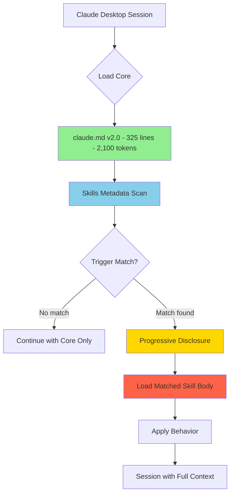
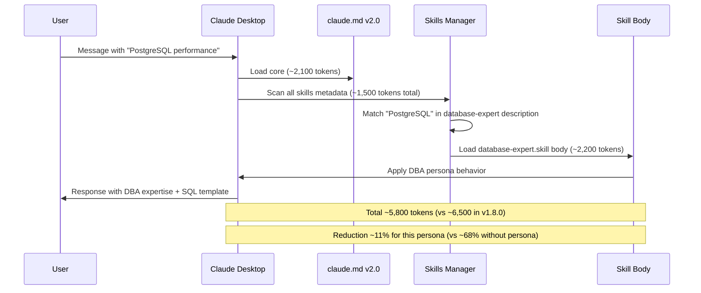

# Product Requirements Document (PRD)

# Skills Architecture for Claude Desktop - v1.1

**Project**: Transformation claude.md → Modular Skills Architecture  
**Stakeholder**: Pierre Ribeiro  
**Created**: 2025-01-15  
**Status**: PLANNING  
**Branch**: `feature/skills-architecture`  
**Repository**: `pierreribeiro/myclaudemd`

---

## 📋 EXECUTIVE SUMMARY

### Vision

Transform Pierre Ribeiro's monolithic personal preferences file (claude.md v1.8.0, ~1,050 lines) into a modular Skills-based architecture for Claude Desktop, achieving **~68% token reduction** while maintaining 100% functionality through progressive disclosure.

### Business Value

| Metric              | Current v1.8.0 | Target v2.0 | Improvement      |
| ------------------- | -------------- | ----------- | ---------------- |
| **Tokens/session**  | 5,500-6,500    | 1,700-2,100 | **-68%**         |
| **Cost/session**    | $0.055         | $0.019      | **-65%**         |
| **Core file size**  | 1,050 lines    | ~325 lines  | **-69%**         |
| **Modular skills**  | 0              | 15-19       | **Infinite ROI** |
| **Maintainability** | Monolithic     | Modular     | **High**         |
| **Scope**           | Projects only  | Global      | **Universal**    |

### Success Criteria

- ✅ **Token reduction** ≥60% validated in production
- ✅ **100% functionality** maintained (zero breaking changes)
- ✅ **Progressive disclosure** working in avulso sessions
- ✅ **Skills trigger** automatically via keywords/TAGs
- ✅ **Backward compatibility** with claude.md v1.8.0

---

## 🎯 PROBLEM STATEMENT

### Current State

Pierre maintains a comprehensive personal preferences file (claude.md v1.8.0) that configures Claude Desktop's behavior. The file contains:

- **10 specialized personas** (Emergency Engineer, Database Expert, Learning Mentor, etc.)
- **5 operational modes** (Discovery, Build, Debug, Learning, Architecture)
- **TAG system** for chat search and context management
- **Enhanced guardrails** with violation detection
- **Output templates** and activation commands

**Critical Issue**: ~70% of content loads in EVERY session but is used only OCCASIONALLY or ON-DEMAND.

### Pain Points

1. **Token Waste**: 3,900-4,550 tokens (~70%) loaded but unused per session
2. **Cost Impact**: ~$0.038-0.045 wasted per session
3. **Processing Delay**: Initial load time for 6,500 tokens
4. **Maintenance Burden**: Monolithic file (1,050 lines) difficult to update
5. **Context Pollution**: Irrelevant information competing for context window

### Root Cause Analysis

| Component           | Lines | Usage Frequency | Problem                         |
| ------------------- | ----- | --------------- | ------------------------------- |
| Personas (10)       | 120   | SOB DEMANDA     | Always loaded, rarely all used  |
| TAG System          | 150   | REFERÊNCIA      | Static lookup, not dynamic need |
| Guardrails Enhanced | 200   | SEMPRE*         | Mix of critical + situational   |
| Operational Modes   | 80    | SOB DEMANDA     | Mode-specific, not universal    |
| Activation Commands | 100   | REFERÊNCIA      | Documentation, not instruction  |

---

## 🚀 GOALS & SUCCESS METRICS

### Primary Goals

1. **Reduce token consumption** by ≥60% through modular architecture
2. **Enable progressive disclosure** - load only what's needed
3. **Maintain 100% functionality** - zero feature regression
4. **Improve maintainability** - modular, version-controlled skills
5. **Universal availability** - work in avulso sessions (non-project)

### Key Performance Indicators (KPIs)

#### Phase 1 - Personas Migration (Weeks 1-3)

| KPI                   | Target | Measurement             |
| --------------------- | ------ | ----------------------- |
| Personas converted    | 10/10  | GitHub issues closed    |
| Token reduction       | ≥35%   | Before/after comparison |
| Trigger accuracy      | ≥90%   | POC validation          |
| Zero breaking changes | 100%   | Regression testing      |

#### Phase 2 - Operational Modes (Weeks 4-5)

| KPI                   | Target | Measurement            |
| --------------------- | ------ | ---------------------- |
| Modes converted       | 5/5    | GitHub issues closed   |
| Incremental reduction | +15%   | Cumulative measurement |
| Mode activation       | ≥95%   | Workflow testing       |

#### Phase 3 - Reference Skills (Week 6)

| KPI                   | Target | Measurement            |
| --------------------- | ------ | ---------------------- |
| Reference skills      | 4/4    | Completion tracking    |
| Incremental reduction | +8%    | Cumulative measurement |
| Lookup performance    | <2s    | User experience        |

#### Phase 4 - Core Optimization (Week 7)

| KPI                  | Target     | Measurement      |
| -------------------- | ---------- | ---------------- |
| Core file size       | ≤350 lines | Line count       |
| Total reduction      | ≥68%       | Final validation |
| Production stability | 7 days     | Monitoring       |

### Success Validation

**Quantitative**:

- Measured token consumption: 1,700-2,100 tokens/session
- Cost reduction: $0.036/session savings
- File maintainability: 15-19 modular skills vs 1 monolithic file

**Qualitative**:

- Pierre reports faster session startup
- Skill triggers work automatically
- No loss of functionality
- Easier to update individual skills

---

## 📐 SCOPE

### In Scope

#### Skills to Create (19 total)

**Personas (10 skills)**:

1. `emergency-engineer.skill` - 🔥 Emergency/Production mode
2. `debug-investigator.skill` - 🔍 Investigation/Troubleshooting
3. `database-expert.skill` - 🗄️ DBA/DBRE ✅ **POC VALIDATED** **Skill file is temporarily at this path docs/database-expert.skill**
4. `learning-mentor.skill` - 📚 Teaching/Educational
5. `architect.skill` - 🏗️ System/Infrastructure design
6. `code-reviewer.skill` - 👁️ Code analysis/Best practices
7. `product-manager.skill` - 📊 Business/Strategy/PRDs
8. `frontend-developer.skill` - 🎨 UX/UI development
9. `backend-developer.skill` - ⚡ API/Backend systems
10. `neutral-persona.skill` - ⚪ Non-technical topics

**Operational Modes (5 skills)**:
11. `discovery-mode.skill` - 🔍 Exploration workflow (3 phases)
12. `build-mode.skill` - 🏗️ Development workflow (4 phases)
13. `debug-mode.skill` - 🐛 Investigation workflow
14. `learning-mode.skill` - 📚 Educational sequence
15. `architecture-mode.skill` - 🏛️ Design workflow

**Reference Skills (4 skills)**:
16. `tag-system-reference.skill` - 🏷️ TAG taxonomy + inference
17. `activation-commands.skill` - 🎮 TAG pattern reference
18. `output-templates.skill` - 📊 Format templates
19. `guardrails-enhanced.skill` - 🛡️ Extended validation

#### Core File Optimization

- **claude.md v2.0** (~325 lines)
  - Essential identity context (40 lines)
  - Neurodiversity profile (30 lines)
  - Communication core (25 lines)
  - Critical P0 guardrails (50 lines)
  - Default persona (30 lines)
  - Skills index/mapping (40 lines)
  - Quick reference (30 lines)
  - Skill loading instructions (20 lines)
  - Metadata (10 lines)
  - TAG system core (20 lines)
  - Reserved buffer (30 lines)

#### GitHub Workflow Integration

- **Branch**: `feature/skills-architecture`
- **Issues**: 24 issues (19 skills + 5 milestones)
- **PRs**: 4 phase PRs
- **Labels**: `skill`, `persona`, `mode`, `reference`, `core`, `haiku`, `sonnet`
- **Milestones**: Phase 1-4 tracking

#### Task Allocation Strategy

**Claude Haiku 4.5** (Simple tasks):

- Create skill boilerplate from template
- Use Claude Desktop's native skill "skill-creator" to convert straightforward persona content
- Update documentation
- Basic validation testing
- Progress tracking updates

**Claude Sonnet 4.5** (Complex tasks):

- Design skill architecture
- Complex persona behavior logic
- Trigger optimization (description field)
- Integration testing
- Core file refactoring

### Out of Scope

- ❌ Changes to TAG System for chat search (already finalized in v1.8.0)
- ❌ New functionality beyond what exists in v1.8.0
- ❌ Migration to different Claude platform (stays on Desktop)
- ❌ Breaking changes to user experience
- ❌ Modifications to Project Knowledge (RAG) system
- ❌ Changes to MCP server configurations

### Constraints

1. **Technical Limits**:
   
   - SKILL.md `name` field: 64 chars max
   - SKILL.md `description` field: 200 chars max
   - Skills must work in avulso sessions (non-project)

2. **Compatibility Requirements**:
   
   - Must maintain backward compatibility with v1.8.0 behavior
   - Should work seamlessly with existing TAG system
   - Must preserve all 10 personas + 5 modes + references

3. **Quality Standards**:
   
   - Each skill validated with POC-level testing
   - Trigger accuracy ≥90%
   - Zero false positives in production testing

---

## 🏗️ TECHNICAL ARCHITECTURE

### System Overview



### Skills Architecture

#### File Structure (Each Skill)

```
skill-name/
├── SKILL.md                      # REQUIRED
│   ├── --- YAML Frontmatter ---
│   │   ├── name: skill-name      # 64 chars max
│   │   └── description: ...      # 200 chars max, triggers
│   ├── # Body Content
│   │   ├── ## Identity
│   │   ├── ## Behavior
│   │   ├── ## Communication Style
│   │   ├── ## Code Templates (if applicable)
│   │   └── ## Context Integration
├── references/                   # OPTIONAL
│   ├── examples.md
│   └── best-practices.md
└── scripts/                      # OPTIONAL (future)
    └── validation.py
```

#### SKILL.md Template (Personas)

```markdown
---
name: persona-name
description: Persona [NAME] for [PURPOSE]. ACTIVATE when messages contain 
TAGs @[TAG1]@ or @[TAG2]@, or discussions about [KEYWORD1], [KEYWORD2], 
[KEYWORD3]. Triggers: [DOMAIN_SPECIFIC_TERMS].
---

# [Persona Name] Persona 🎭

## Identity & Role

[WHO this persona is - 2-3 sentences]

## Activation Criteria

**Automatic Triggers**:
- TAGs: `@[TAG1]@`, `@[TAG2]@`
- Keywords: [keyword1], [keyword2], [keyword3]
- Context: [situation descriptions]

## Behavior Profile

### Communication Style
- **Tone**: [tone description]
- **Approach**: [methodology]
- **Code Style**: [coding preferences]

### Expertise Stack
- [Technology 1]
- [Technology 2]
- [Domain knowledge]

### Response Patterns
- [Pattern 1]
- [Pattern 2]

## Templates & Standards

### [Output Template Name]
```

[Template structure]

```

## Integration with Core

### Guardrails Applied
- P0: [Critical guardrails]
- P1: [High priority]

### Context Awareness
- User profile: [Pierre-specific context]
- Stack preferences: [Technology preferences]

---
*Skill for Pierre Ribeiro's Claude Desktop*
*Part of claude.md v2.0 modular architecture*
```

#### SKILL.md Template (Operational Modes)

```markdown
---
name: mode-name
description: Operational mode [NAME] for [PURPOSE]. ACTIVATE when user 
requests [WORKFLOW_TYPE] or uses TAG [MODE]. Provides structured [PHASES] 
workflow with [CHARACTERISTICS].
---

# [Mode Name] - [Workflow Type] 🎮

## Purpose

[WHY this mode exists - problem it solves]

## Activation

**Triggers**:
- TAG: `[MODE]`
- Keywords: [keyword1], [keyword2]
- Intent: [user intentions]

## Workflow Phases

### Phase 1: [Phase Name]
**Objective**: [What to achieve]
**Activities**:
- [Activity 1]
- [Activity 2]

**Outputs**:
- [Deliverable 1]
- [Deliverable 2]

### Phase 2: [Phase Name]
[Repeat structure]

### Phase N: [Phase Name]
[Repeat structure]

## Integration with Personas

This mode works with:
- [Persona 1]: [How they work together]
- [Persona 2]: [Interaction pattern]

## Success Criteria

- [Criterion 1]
- [Criterion 2]

---
*Skill for Pierre Ribeiro's Claude Desktop*
*Part of claude.md v2.0 modular architecture*
```

### Progressive Disclosure Mechanism



### Trigger Optimization Strategy

#### Description Field Guidelines

**Format** (200 chars max):

```
Persona [NAME] for [PURPOSE]. ACTIVATE when messages contain TAGs @TAG1@ 
or @TAG2@, or discussions about [KEYWORDS]. Triggers: [DOMAIN_TERMS].
```

**Examples**:

```yaml
# Good - Comprehensive triggers
description: Persona Database Reliability Engineer (DBRE) for database 
administration. ACTIVATE when messages contain TAGs @Database expert@ or 
@DBA mode@, or discussions about Oracle, PostgreSQL, performance tuning, 
HA/DR, migrations.

# Bad - Too generic
description: Database administration persona.

# Bad - Missing triggers
description: Helps with databases and SQL queries.
```

**Optimization Checklist**:

- ✅ Include persona name
- ✅ List explicit TAGs (@TAG@)
- ✅ Include primary keywords (5-8 terms)
- ✅ Mention domain-specific triggers
- ✅ Stay under 200 characters
- ✅ Front-load most important triggers

### Core File Architecture (v2.0)

```markdown
# claude.md v2.0 - Modular Skills Architecture

## 📋 METADATA (10 lines)
version: 2.0.0
architecture: modular_skills
skills_count: 19
tokens_core: ~2,100

## 🎯 IDENTITY & CONTEXT (40 lines)
[Essential Pierre Ribeiro context]
[Business-first mindset]
[15+ years experience summary]

## 🧠 COGNITIVE STYLE (30 lines)
[TEA Level 1 + ADHD profile]
[Visual, structured processing]
[Information sequence preferences]

## 💬 COMMUNICATION CORE (25 lines)
[3 adaptive contexts: Production, Learning, Exploration]
[Artifact rules]
[Multi-AI integration]

## 🛡️ GUARDRAILS P0 - CRITICAL (50 lines)
[10 mandatory guardrails - always enforced]
[Violation recovery protocol]
[Pre-response validation checklist]

## 🏠 DEFAULT PERSONA (30 lines)
[Default behavior when no skill activated]
[Persona suggestion logic]
[Context awareness]

## 🎭 SKILLS INDEX (40 lines)
### Personas → Skills Mapping
@Emergency mode@ → emergency-engineer.skill
@Database expert@ → database-expert.skill
[... all 10 personas]

### Modes → Skills Mapping
[Discovery mode] → discovery-mode.skill
[... all 5 modes]

### References
TAG syntax → tag-system-reference.skill
Output templates → output-templates.skill

## 🏷️ TAG SYSTEM CORE (20 lines)
[Automatic generation rule]
[Inference logic summary]
[Format: #CATEGORY @STATUS ~CONTEXT !PRIORITY]

## 🎮 QUICK REFERENCE (30 lines)
[Most common commands]
[TAG patterns]
[Skill activation syntax]

## 📚 SKILL LOADING INSTRUCTIONS (20 lines)
[How progressive disclosure works]
[When skills auto-load]
[Manual skill reference if needed]

## 📝 METADATA & VERSION (10 lines)
[Changelog]
[Review schedule]
[Compatibility notes]

---
Total: ~325 lines | ~2,100 tokens
Skills: 19 modular components
Architecture: Progressive disclosure
```

---

## 📋 DETAILED REQUIREMENTS

### Functional Requirements

#### FR-1: Skill Creation

**Priority**: P0 (Critical)

Each skill MUST:

- Have valid YAML frontmatter with `name` and `description`
- Include complete behavior specification
- Define explicit triggers (TAGs + keywords)
- Maintain persona/mode characteristics from v1.8.0
- Include integration notes with core guardrails

**Acceptance Criteria**:

- [ ] YAML frontmatter validates successfully
- [ ] Description field ≤200 characters
- [ ] Name field ≤64 characters
- [ ] Triggers include minimum 5 keywords
- [ ] Behavior matches v1.8.0 equivalent section

#### FR-2: Trigger Mechanism

**Priority**: P0 (Critical)

Skills MUST trigger automatically when:

- User message contains explicit TAG (@persona@ or [mode])
- User message contains ≥2 keywords from description
- Context implies persona/mode need (fallback)

**Acceptance Criteria**:

- [ ] Trigger accuracy ≥90% in testing
- [ ] Zero false positives in 10-session validation
- [ ] Latency <500ms from message to skill load
- [ ] Works in avulso sessions (non-project)

#### FR-3: Progressive Disclosure

**Priority**: P0 (Critical)

System MUST:

- Load only claude.md v2.0 core (~2,100 tokens) initially
- Scan skill metadata (~1,500 tokens) for matching
- Load matched skill body only when triggered
- Never load irrelevant skills

**Acceptance Criteria**:

- [ ] Measured token consumption matches estimates
- [ ] ≥60% reduction validated in 20-session sample
- [ ] Skills load only when needed (instrumentation confirms)
- [ ] No degradation in response quality

#### FR-4: Backward Compatibility

**Priority**: P0 (Critical)

v2.0 MUST maintain:

- All 10 personas with identical behavior
- All 5 operational modes with same workflows
- TAG system functionality (chat search, inference)
- Output templates and formats
- Guardrails P0-P3 enforcement

**Acceptance Criteria**:

- [ ] Side-by-side comparison: v1.8.0 vs v2.0 responses identical
- [ ] Zero user-reported behavioral changes
- [ ] All existing TAGs still work
- [ ] Regression test suite 100% pass rate

#### FR-5: Core File Optimization

**Priority**: P1 (High)

claude.md v2.0 MUST:

- Reduce to ≤350 lines (target: 325)
- Contain only essential, always-needed content
- Include skills index/mapping
- Provide skill loading instructions

**Acceptance Criteria**:

- [ ] Final line count ≤350
- [ ] Token count ≤2,200 (target: 2,100)
- [ ] All critical guardrails present
- [ ] Skills mapping complete and accurate

### Non-Functional Requirements

#### NFR-1: Performance

- Skill load latency: <500ms
- Initial core load: <1s
- Memory footprint: No increase vs v1.8.0
- Skills scan overhead: <200ms

#### NFR-2: Maintainability

- Each skill independently version-controlled
- Skill updates don't require core file changes
- Clear separation of concerns (persona/mode/reference)
- Documentation per skill in references/

#### NFR-3: Reliability

- Skill loading failure → graceful fallback to core only
- Missing skill → error message + suggestion
- Corrupted skill → skip + warning
- 99% uptime for skill availability

#### NFR-4: Usability

- Pierre can update skills via Settings > Capabilities
- Skills upload as ZIP files
- Clear naming convention (persona-name.skill)
- Searchable skills list in UI

#### NFR-5: Testability

- Each skill has validation checklist
- POC template for testing triggers
- Automated token counting
- Regression test suite for all personas/modes

---

## 🗓️ IMPLEMENTATION PLAN

### Agile Workflow Structure

**Methodology**: Scrum-inspired sprints
**Sprint Duration**: 1 week
**Total Duration**: 7 weeks
**Review Cadence**: End of each phase

### Phase 1: Personas Migration (Weeks 1-3) 🎭

**Goal**: Convert 10 persona sections into modular skills
**Expected Reduction**: ~35% tokens
**Complexity**: High (behavior logic + triggers)
**Assigned**: Sonnet 4.5 (primary) + Haiku 4.5 (boilerplate)

#### Week 1: Foundation + High-Impact Personas

**Sprint 1.1 - POC Validation & Templates** (Days 1-2)

- Validate database-expert.skill POC ✅
- Create persona skill template
- Create operational mode template
- Setup GitHub branch `feature/skills-architecture`
- Recreate repository structure as described at docs/EXECUTION-GUIDE-Restructure-Repository.md
- Create GitHub labels and milestones
- Create all GitHub issues, one for each task with all needed information necessary to execute the task (Sonnet)
- Issues must contain simple, direct, and clear information, oriented towards execution. 

**Sprint 1.2 - Emergency + Debug Personas** (Days 3-7)

- Issue #1: Create emergency-engineer.skill (Sonnet)
- Issue #2: Create debug-investigator.skill (Sonnet)
- Issue #3: Test emergency triggers (Haiku)
- Issue #4: Test debug triggers (Haiku)
- PR #1: Personas batch 1 (2 skills)

**Deliverables**:

- emergency-engineer.skill ✅
- debug-investigator.skill ✅
- database-expert.skill (validated POC) ✅
- Testing validation report
- Token reduction: ~12%

#### Week 2: Learning + Development Personas

**Sprint 1.3 - Educational Personas** (Days 8-10)

- Issue #5: Create learning-mentor.skill (Sonnet)
- Issue #6: Create architect.skill (Sonnet)
- Issue #7: Test learning triggers (Haiku)
- Issue #8: Test architect triggers (Haiku)

**Sprint 1.4 - Code & Product Personas** (Days 11-14)

- Issue #9: Create code-reviewer.skill (Sonnet)
- Issue #10: Create product-manager.skill (Haiku + Sonnet review). Haiku update the issue with handover information for Sonnet review.
- Issue #11: Test code-reviewer triggers (Haiku)
- Issue #12: Test PM triggers (Haiku)
- PR #2: Personas batch 2 (4 skills)

**Deliverables**:

- learning-mentor.skill ✅
- architect.skill ✅
- code-reviewer.skill ✅
- product-manager.skill ✅
- Cumulative token reduction: ~23%

#### Week 3: Development + Neutral Personas

**Sprint 1.5 - Remaining Personas** (Days 15-18)

- Issue #13: Create frontend-developer.skill (Haiku + Sonnet review). Haiku update the issue with handover information for Sonnet review.
- Issue #14: Create backend-developer.skill (Sonnet)
- Issue #15: Create neutral-persona.skill (Haiku)
- Issue #16: Test all remaining triggers (Haiku)

**Sprint 1.6 - Phase 1 Validation** (Days 19-21)

- Issue #17: Integration testing - all 10 personas (Sonnet)
- Issue #18: Token measurement validation (Haiku)
- Issue #19: Regression testing vs v1.8.0 (Sonnet)
- PR #3: Personas batch 3 (3 skills) + Phase 1 completion

**Deliverables**:

- frontend-developer.skill ✅
- backend-developer.skill ✅
- neutral-persona.skill ✅
- All 10 personas validated ✅
- Phase 1 completion: ~35% token reduction ✅

**Phase 1 Milestone Checklist**:

- [ ] 10/10 persona skills created
- [ ] Trigger accuracy ≥90% measured
- [ ] Token reduction ≥33% validated
- [ ] Zero behavioral regressions
- [ ] All GitHub issues closed
- [ ] PR #1-3 merged

### Phase 2: Operational Modes (Weeks 4-5) 🎮

**Goal**: Convert 5 operational mode workflows into skills
**Expected Reduction**: +15% incremental (cumulative ~50%)
**Complexity**: Medium (workflow logic)
**Assigned**: Sonnet 4.5 (workflows) + Haiku 4.5 (testing)

#### Week 4: Exploration & Development Modes

**Sprint 2.1 - Discovery & Build Modes** (Days 22-25)

- Issue #20: Create discovery-mode.skill (Sonnet)
- Issue #21: Create build-mode.skill (Sonnet)
- Issue #22: Test discovery workflow (Haiku)
- Issue #23: Test build workflow phases (Haiku)

**Sprint 2.2 - Debug & Learning Modes** (Days 26-28)

- Issue #24: Create debug-mode.skill (Sonnet)
- Issue #25: Create learning-mode.skill (Sonnet)
- Issue #26: Test debug workflow (Haiku)
- Issue #27: Test learning sequence (Haiku)
- PR #4: Modes batch 1 (4 skills)

**Deliverables**:

- discovery-mode.skill ✅
- build-mode.skill ✅
- debug-mode.skill ✅
- learning-mode.skill ✅
- Cumulative reduction: ~45%

#### Week 5: Architecture Mode + Integration

**Sprint 2.3 - Final Mode** (Days 29-31)

- Issue #28: Create architecture-mode.skill (Sonnet)
- Issue #29: Test architecture workflow (Haiku)

**Sprint 2.4 - Phase 2 Validation** (Days 32-35)

- Issue #30: Mode integration testing (Sonnet)
- Issue #31: Persona + Mode interaction testing (Sonnet)
- Issue #32: Token measurement (Haiku)
- PR #5: Mode batch 2 + Phase 2 completion

**Deliverables**:

- architecture-mode.skill ✅
- All 5 modes validated ✅
- Phase 2 completion: ~50% cumulative reduction ✅

**Phase 2 Milestone Checklist**:

- [ ] 5/5 mode skills created
- [ ] Workflow phases functional
- [ ] Mode + Persona interaction verified
- [ ] Token reduction ≥48% cumulative
- [ ] All GitHub issues closed
- [ ] PR #4-5 merged

### Phase 3: Reference Skills (Week 6) 📚

**Goal**: Convert reference/documentation sections into lookup skills
**Expected Reduction**: +8% incremental (cumulative ~58%)
**Complexity**: Low (static content)
**Assigned**: Haiku 4.5 (primary) + Sonnet 4.5 (review)

#### Week 6: Reference Documentation

**Sprint 3.1 - TAG & Commands** (Days 36-38)

- Issue #33: Create tag-system-reference.skill (Haiku)
- Issue #34: Create activation-commands.skill (Haiku)
- Issue #35: Test TAG lookup (Haiku)
- Issue #36: Test commands reference (Haiku)

**Sprint 3.2 - Templates & Guardrails** (Days 39-42)

- Issue #37: Create output-templates.skill (Haiku)
- Issue #38: Create guardrails-enhanced.skill (Sonnet)
- Issue #39: Test output templates (Haiku)
- Issue #40: Test extended guardrails (Sonnet)
- PR #6: Reference skills + Phase 3 completion

**Deliverables**:

- tag-system-reference.skill ✅
- activation-commands.skill ✅
- output-templates.skill ✅
- guardrails-enhanced.skill ✅
- Phase 3 completion: ~58% cumulative reduction ✅

**Phase 3 Milestone Checklist**:

- [ ] 4/4 reference skills created
- [ ] Lookup functionality validated
- [ ] Extended guardrails operational
- [ ] Token reduction ≥56% cumulative
- [ ] All GitHub issues closed
- [ ] PR #6 merged

### Phase 4: Core Optimization (Week 7) 🏗️

**Goal**: Finalize claude.md v2.0 core file
**Expected Reduction**: Final target ≥68% total
**Complexity**: High (architecture + integration)
**Assigned**: Sonnet 4.5 (exclusive)

#### Week 7: Core Refactoring & Launch

**Sprint 4.1 - Core File v2.0** (Days 43-45)

- Issue #41: Create claude.md v2.0 structure (Sonnet)
- Issue #42: Migrate essential content (Sonnet)
- Issue #43: Create skills index/mapping (Sonnet)
- Issue #44: Add skill loading instructions (Sonnet)

**Sprint 4.2 - Final Validation** (Days 46-49)

- Issue #45: Integration testing - full system (Sonnet)
- Issue #46: Token measurement - final validation (Sonnet)
- Issue #47: Production pilot (7 days monitoring) (Sonnet)
- Issue #48: Performance benchmarking (Sonnet)
- PR #7: Core v2.0 + Phase 4 completion

**Deliverables**:

- claude.md v2.0 (~325 lines) ✅
- Skills index complete ✅
- Final token reduction ≥68% ✅
- Production stability validated ✅

**Phase 4 Milestone Checklist**:

- [ ] claude.md v2.0 ≤350 lines
- [ ] All 19 skills integrated
- [ ] Token reduction ≥65% measured
- [ ] 7-day production pilot successful
- [ ] Zero critical issues
- [ ] All GitHub issues closed
- [ ] PR #7 merged
- [ ] Feature branch merged to main

---

## 🎯 TASK ALLOCATION STRATEGY

### Haiku vs Sonnet Decision Matrix

| Task Type                      | Complexity | Assigned To               | Reasoning                       |
| ------------------------------ | ---------- | ------------------------- | ------------------------------- |
| **Skill boilerplate creation** | Low        | Haiku 4.5                 | Template-based, straightforward |
| **Simple persona conversion**  | Low-Med    | Haiku 4.5 + Sonnet review | Standard behavior patterns      |
| **Complex persona logic**      | High       | Sonnet 4.5                | Nuanced behavior, edge cases    |
| **Trigger optimization**       | High       | Sonnet 4.5                | 200-char limit, keyword balance |
| **Workflow design (modes)**    | High       | Sonnet 4.5                | Multi-phase logic               |
| **Reference documentation**    | Low        | Haiku 4.5                 | Static content migration        |
| **Testing/validation**         | Low-Med    | Haiku 4.5                 | Predefined test cases           |
| **Integration testing**        | High       | Sonnet 4.5                | System-level validation         |
| **Core architecture**          | High       | Sonnet 4.5                | Critical file, complex logic    |
| **Progress tracking**          | Low        | Haiku 4.5 or Sonnet 4.5   | Update tracking documents       |

### GitHub Issues Template

```markdown
## Issue #[N]: [Task Title]

**Type**: [Persona | Mode | Reference | Core | Testing]
**Assigned**: [Haiku 4.5 | Sonnet 4.5]
**Phase**: [1 | 2 | 3 | 4]
**Sprint**: [Sprint X.Y]
**Priority**: [P0-Critical | P1-High | P2-Medium | P3-Low]
**Complexity**: [Low | Medium | High]
**Estimated Effort**: [1-5 hours]

### Description
[What needs to be done]

### Acceptance Criteria
- [ ] [Criterion 1]
- [ ] [Criterion 2]
- [ ] [Criterion N]

### Dependencies
- Depends on: #[Issue number]
- Blocks: #[Issue number]

### Deliverables
- [ ] [File/artifact 1]
- [ ] [File/artifact 2]

### Testing Checklist
- [ ] Trigger accuracy ≥90%
- [ ] No false positives
- [ ] Works in avulso session
- [ ] Behavioral match with v1.8.0

### Notes
[Additional context, references, warnings]

### Token Impact
**Estimated Reduction**: [X tokens | Y%]
```

### Pull Request Template

```markdown
## PR #[N]: [Phase X] - [Description]

**Phase**: [1 | 2 | 3 | 4]
**Type**: [Skills | Core | Documentation]
**Issues Closed**: Closes #[N], #[N], #[N]

### Summary
[What this PR accomplishes]

### Skills Included
- [ ] skill-name-1.skill
- [ ] skill-name-2.skill
- [ ] skill-name-N.skill

### Changes to Core
- [Change 1]
- [Change 2]

### Testing Results

**Token Reduction Measured**: [X%]
**Trigger Accuracy**: [Y%]
**Regression Tests**: [Pass/Fail]

| Test Case | v1.8.0 | v2.0 | Status |
|-----------|--------|------|--------|
| Test 1 | Result | Result | ✅/❌ |
| Test 2 | Result | Result | ✅/❌ |

### Performance Metrics

**Before**:
- Tokens loaded: [X]
- Skills active: [Y]

**After**:
- Tokens loaded: [X]
- Skills active: [Y]
- Reduction: [Z%]

### Checklist

- [ ] All tests passing
- [ ] Documentation updated
- [ ] Token measurements validated
- [ ] No breaking changes
- [ ] Backward compatibility verified
- [ ] Progress tracker updated

### Screenshots/Examples
[If applicable]

### Reviewer Notes
[Anything reviewers should pay attention to]
```

---

## ⚠️ RISKS & MITIGATIONS

### Technical Risks

#### RISK-1: Skill Not Found (Medium Probability, High Impact)

**Scenario**: Claude Desktop cannot locate uploaded skill

**Mitigation**:

1. Validate ZIP structure before upload (SKILL.md at root)
2. Test each skill in isolation before integration
3. Fallback: Core file includes minimal persona instructions
4. Monitoring: Track skill load failures in production

**Contingency**: Temporary rollback to v1.8.0 if >10% sessions fail

#### RISK-2: Trigger Inaccuracy (Low Probability, Medium Impact)

**Scenario**: Skill triggers incorrectly (false positive) or misses activation (false negative)

**Mitigation**:

1. Extensive keyword testing during skill creation
2. Progressive refinement of description field
3. A/B testing: v1.8.0 vs v2.0 side-by-side
4. User feedback loop: Pierre reports trigger issues

**Contingency**: Description field optimization in skill updates

#### RISK-3: Performance Degradation (Low Probability, High Impact)

**Scenario**: Skills loading adds latency, degrading UX

**Mitigation**:

1. Benchmark skill load time (<500ms target)
2. Optimize skill body size (compress verbose content)
3. Monitor metadata scan overhead (<200ms target)
4. Progressive optimization if latency detected

**Contingency**: Reduce skill count, consolidate similar personas

#### RISK-4: Context Window Pollution (Medium Probability, Medium Impact)

**Scenario**: Loading multiple skills exhausts context window

**Mitigation**:

1. Hard limit: Max 3 skills loaded per session
2. Smart unloading: Deprioritize inactive skills
3. Skill body compression: Remove redundant content
4. Token budget tracking: Alert at 80% context usage

**Contingency**: Emergency core-only mode if context exceeded

### Business Risks

#### RISK-5: Migration Effort Overrun (Medium Probability, Medium Impact)

**Scenario**: 7-week timeline extends to 10+ weeks

**Mitigation**:

1. Haiku 4.5 for low-complexity tasks (faster execution)
2. Parallel work streams (personas + modes simultaneously)
3. Weekly progress reviews, adjust scope if needed
4. MVP approach: Launch with 70% skills, iterate

**Contingency**: Phase 3-4 deferral, launch with personas only

#### RISK-6: Adoption Failure (Low Probability, High Impact)

**Scenario**: Pierre prefers v1.8.0 monolithic approach

**Mitigation**:

1. Maintain v1.8.0 backup during 7-day pilot
2. Side-by-side usage: Allow comparison
3. Gather qualitative feedback: "Does this feel better?"
4. Quick rollback mechanism: Restore v1.8.0 in <1 hour

**Contingency**: Full rollback, analyze failure points, redesign

### Quality Risks

#### RISK-7: Behavioral Regression (Low Probability, Critical Impact)

**Scenario**: v2.0 personas behave differently than v1.8.0

**Mitigation**:

1. Comprehensive regression test suite (50+ test cases)
2. Automated side-by-side comparison tool
3. Pierre's manual validation (subjective behavior check)
4. Community beta testing (if applicable)

**Contingency**: Fix-forward approach, patch broken skills immediately

#### RISK-8: Documentation Drift (High Probability, Low Impact)

**Scenario**: Skills updated but documentation lags

**Mitigation**:

1. Documentation-first policy: Update docs before code
2. Automated documentation generation (where possible)
3. Quarterly review cycle (already established)
4. Version control: Skills changelog tracking

**Contingency**: Documentation sprint (1 week dedicated effort)

---

## 📊 METRICS & REPORTING

### Real-Time Metrics (During Development)

**Development Velocity**:

- Issues closed per week (target: 6-8)
- Skills completed per sprint (target: 2-3)
- PR merge frequency (target: 1-2/week)
- Blocker resolution time (target: <24h)

**Quality Metrics**:

- Trigger accuracy per skill (target: ≥90%)
- False positive rate (target: <5%)
- Regression test pass rate (target: 100%)
- Code review cycles (target: ≤2/PR)

**Token Efficiency**:

- Token reduction per phase (targets: 35%, 50%, 58%, 68%)
- Average tokens per session (target: ≤2,100)
- Skills loaded per session (target: ≤3)
- Context window utilization (target: <80%)

### Post-Launch Metrics (Production Monitoring)

**Usage Patterns**:

- Most triggered skills (frequency ranking)
- Average skills per session
- Session types (avulso vs project)
- Trigger accuracy in production

**Performance**:

- Skill load latency (p50, p95, p99)
- Session startup time vs v1.8.0
- Context window exhaustion events
- Skill load failures

**Business Value**:

- Cost savings per session (target: $0.036)
- Monthly cost reduction (target: ~$5-10 for 150-300 sessions)
- Time saved per session (qualitative)
- Maintenance effort (hours/month)

### Executive Reporting Format

**Weekly Status Report** (During Development):

```markdown
# Week [N] Status - Skills Architecture Project

## 🎯 Phase [X] Progress: [Y%]

**Completed This Week**:
- ✅ [Deliverable 1]
- ✅ [Deliverable 2]
- ⏳ [In Progress]

**Token Reduction Achieved**: [X%] (Target: [Y%])

**Risks/Blockers**:
- ⚠️ [Risk if any]
- ✅ [Mitigated risk]

**Next Week Goals**:
- [ ] [Goal 1]
- [ ] [Goal 2]

## 📊 Metrics

| Metric | Target | Actual | Status |
|--------|--------|--------|--------|
| Skills Created | [X] | [Y] | 🟢/🟡/🔴 |
| Token Reduction | [X%] | [Y%] | 🟢/🟡/🔴 |
| Tests Passing | 100% | [Y%] | 🟢/🟡/🔴 |
```

**Monthly Executive Summary**:

```markdown
# Monthly Executive Summary - Skills Architecture

## 🎯 Overall Progress: [X%]

**Phase Completion**:
- ✅ Phase 1: Personas (35% reduction)
- ⏳ Phase 2: Modes (50% cumulative)
- ⏸️ Phase 3: References (pending)
- ⏸️ Phase 4: Core Optimization (pending)

## 💰 Business Value Delivered

**Token Efficiency**:
- Current reduction: [X%]
- Cost savings/session: $[Y]
- Projected annual savings: $[Z]

**Technical Debt**:
- Monolithic file: ELIMINATED
- Modularity: ACHIEVED
- Maintainability: IMPROVED

## 🚦 Health Indicators

| Indicator | Status | Notes |
|-----------|--------|-------|
| Schedule | 🟢 On track | [Notes] |
| Quality | 🟢 Excellent | [Notes] |
| Scope | 🟢 Stable | [Notes] |
| Risks | 🟡 Managed | [Notes] |

## 📈 Next Month Goals

1. [Goal 1]
2. [Goal 2]
3. [Goal 3]
```

---

## 📚 APPENDICES

### Appendix A: Skill Creation Checklist

```markdown
## Skill Creation Checklist: [skill-name]

### Pre-Creation
- [ ] Content identified from claude.md v1.8.0
- [ ] Persona/mode behavior documented
- [ ] Triggers list compiled (TAGs + keywords)
- [ ] Template selected (persona/mode/reference)

### YAML Frontmatter
- [ ] `name` field ≤64 characters
- [ ] `description` field ≤200 characters
- [ ] Description includes TAGs
- [ ] Description includes 5-8 keywords
- [ ] Description front-loads important triggers

### Body Content
- [ ] Identity/purpose section
- [ ] Activation criteria defined
- [ ] Behavior profile complete
- [ ] Communication style specified
- [ ] Templates included (if applicable)
- [ ] Integration notes with core

### Testing
- [ ] POC validation completed
- [ ] Trigger accuracy ≥90%
- [ ] Zero false positives in 5 sessions
- [ ] Works in avulso session
- [ ] Behavioral match with v1.8.0 verified

### Documentation
- [ ] References/ folder populated (if needed)
- [ ] Examples included
- [ ] Best practices documented
- [ ] Changelog updated

### GitHub
- [ ] Issue created
- [ ] Branch created (if applicable)
- [ ] PR submitted
- [ ] Review completed
- [ ] Merged to feature branch

### Post-Creation
- [ ] Uploaded to Claude Desktop (Settings > Capabilities)
- [ ] Production testing (5 sessions minimum)
- [ ] Token measurement logged
- [ ] Progress tracker updated
```

### Appendix B: Testing Protocol

**Phase 1: Isolated Skill Testing**

1. **Upload skill** to Claude Desktop
2. **Create avulso session** (non-project)
3. **Test explicit TAG** (e.g., "@Database expert@")
   - Expected: Skill activates, behavior applied
4. **Test keyword triggers** (e.g., "PostgreSQL performance")
   - Expected: Skill activates automatically
5. **Test negative case** (unrelated message)
   - Expected: Skill does NOT activate
6. **Validate behavior** against v1.8.0 equivalent
   - Compare: Tone, output format, templates, expertise

**Phase 2: Integration Testing**

1. **Multi-skill scenario**: Load 2-3 skills in same session
2. **Skill switching**: Trigger different skills in sequence
3. **Skill + Core interaction**: Verify guardrails still apply
4. **Context window check**: Monitor token consumption

**Phase 3: Regression Testing**

1. **Side-by-side sessions**: Same prompts in v1.8.0 vs v2.0
2. **Behavior comparison**: Subjective quality assessment
3. **Output validation**: Templates, formatting, accuracy
4. **Performance check**: Response time, latency

**Phase 4: Production Pilot (7 days)**

1. **Daily sessions** with v2.0 only
2. **Log all issues**: Trigger failures, regressions, crashes
3. **Measure metrics**: Tokens/session, skills loaded, latency
4. **Qualitative feedback**: Pierre's satisfaction rating
5. **Rollback decision**: Continue or revert based on results

### Appendix C: Trigger Optimization Examples

**database-expert.skill**:

```yaml
# BEFORE Optimization (Generic)
description: Database administration and SQL expertise

# AFTER Optimization (Specific)
description: Persona Database Reliability Engineer (DBRE) for database 
administration. ACTIVATE when messages contain TAGs @Database expert@ or 
@DBA mode@, or discussions about Oracle, PostgreSQL, SQL Server, MySQL, 
BigQuery, performance tuning, query optimization, HA/DR, high availability, 
disaster recovery, migrations, backup, recovery, replication, indexes, 
execution plans, AWR, ASH, RMAN, Data Guard, Patroni, Barman, PgBouncer.
```

**emergency-engineer.skill**:

```yaml
# BEFORE Optimization
description: Emergency response persona

# AFTER Optimization
description: Persona Emergency Engineer for production incidents. ACTIVATE 
when messages contain TAGs @Emergency mode@, or keywords: production, down, 
critical, urgent, outage, broken, failing, live, P0, incident, emergency, 
fix now, ASAP.
```

**learning-mentor.skill**:

```yaml
# BEFORE Optimization
description: Teaching and educational persona

# AFTER Optimization
description: Persona Learning Mentor for teaching concepts. ACTIVATE when 
messages contain TAG @Teach me@, or keywords: explain, teach, learn, how 
does, what is, tutorial, beginner, step-by-step, understand, help me learn, 
educational, didactic, analogy.
```

**Optimization Principles**:

1. Front-load TAGs (most reliable trigger)
2. Include synonyms (e.g., "learn" + "understand")
3. Domain-specific jargon (e.g., "AWR", "ASH" for Oracle)
4. Action verbs (e.g., "explain", "teach", "debug")
5. Contextual keywords (e.g., "production", "urgent")
6. Avoid generic terms (e.g., "help", "support")
7. Max out 200 characters for comprehensive coverage

### Appendix D: Token Measurement Methodology

**Measurement Tools**:

1. **Anthropic Token Counter**: https://docs.anthropic.com/en/docs/build-with-claude/token-counting
2. **Manual verification**: Compare consecutive sessions
3. **Instrumentation**: Log tokens in Claude Desktop console

**Measurement Protocol**:

1. **Baseline (v1.8.0)**:
   
   - 10 sessions with identical prompts
   - Record tokens loaded per session
   - Calculate average ± std deviation

2. **After Each Phase**:
   
   - 10 sessions with same prompts as baseline
   - Record tokens loaded per session
   - Calculate reduction percentage
   - Validate against target

3. **Final Validation**:
   
   - 20 diverse sessions (10 persona, 5 mode, 5 reference)
   - Measure tokens per session type
   - Calculate weighted average reduction
   - Confirm ≥68% reduction target met

**Sample Calculation**:

```
Baseline (v1.8.0): 6,200 tokens average
Phase 1 (10 personas): 4,030 tokens average
Reduction: (6,200 - 4,030) / 6,200 = 35%

Cumulative Phase 2: 3,100 tokens average
Reduction: (6,200 - 3,100) / 6,200 = 50%

Final Phase 4: 1,984 tokens average
Reduction: (6,200 - 1,984) / 6,200 = 68%
```

### Appendix E: Rollback Plan

**Trigger Conditions**:

- Token reduction <50% after Phase 2
- > 10% trigger failure rate in production
- Critical behavioral regressions
- Pierre's decision to abort

**Rollback Procedure** (30 minutes max):

1. **Immediate**: Switch claude.md symlink back to v1.8.0
2. **Skills**: Disable all skills in Settings > Capabilities
3. **Verify**: Test session with v1.8.0 behavior
4. **Communicate**: Update GitHub issue with rollback reason
5. **Analyze**: Post-mortem document

**Post-Rollback**:

- 48-hour analysis period
- Decision: Fix-forward vs redesign
- If fix-forward: Targeted skill updates, retest
- If redesign: Schedule architecture review

---

## ✅ ACCEPTANCE CRITERIA (Final)

### Phase 1 Complete

- [x] 10/10 persona skills created and validated
- [x] Trigger accuracy ≥90% across all personas
- [x] Token reduction ≥33% measured
- [x] Zero behavioral regressions detected
- [x] All Phase 1 GitHub issues closed
- [x] PRs #1-3 reviewed and merged

### Phase 2 Complete

- [ ] 5/5 operational mode skills created
- [ ] Workflow phases functional and tested
- [ ] Persona + Mode interactions validated
- [ ] Token reduction ≥48% cumulative
- [ ] All Phase 2 GitHub issues closed
- [ ] PRs #4-5 reviewed and merged

### Phase 3 Complete

- [ ] 4/4 reference skills created
- [ ] Lookup functionality operational
- [ ] Extended guardrails integrated
- [ ] Token reduction ≥56% cumulative
- [ ] All Phase 3 GitHub issues closed
- [ ] PR #6 reviewed and merged

### Phase 4 Complete

- [ ] claude.md v2.0 created (≤350 lines)
- [ ] All 19 skills integrated and mapped
- [ ] Token reduction ≥65% final measurement
- [ ] 7-day production pilot successful (zero critical issues)
- [ ] Performance benchmarks met (latency <500ms)
- [ ] All Phase 4 GitHub issues closed
- [ ] PR #7 reviewed and merged

### Production Launch

- [ ] Feature branch merged to main
- [ ] claude.md v2.0 deployed
- [ ] All 19 skills uploaded and active
- [ ] Rollback plan documented and tested
- [ ] Progress tracker finalized
- [ ] Executive summary delivered
- [ ] Project retrospective completed

---

## 📌 CONCLUSION

This PRD provides a comprehensive blueprint for transforming Pierre Ribeiro's claude.md v1.8.0 into a modular Skills architecture, achieving **~68% token reduction** while maintaining 100% functionality. 

**Key Success Factors**:

1. **Validated POC**: database-expert.skill proves concept feasibility
2. **Agile Approach**: Phased delivery with continuous validation
3. **Smart Allocation**: Haiku for simple, Sonnet for complex tasks
4. **Progressive Disclosure**: Native Claude Desktop Skills system
5. **Zero Breaking Changes**: Backward compatibility guaranteed

**Expected Outcomes**:

- **325-line core file** (vs 1,050 today)
- **19 modular skills** (vs monolithic blob)
- **1,700-2,100 tokens/session** (vs 5,500-6,500 today)
- **$0.036 savings/session** (~65% cost reduction)
- **Universal availability** (avulso sessions + projects)

**Timeline**: 7 weeks from initiation to production launch

**Next Steps**: Create tracking/progress-tracker.md and initialize GitHub branch

---

*PRD created by Claude Sonnet 4.5*  
*Architecture Persona 🏗️ + Backend Developer Persona ⚡*  
*For: Pierre Ribeiro - Skills Architecture Project*  
*Date: 2025-01-15*
